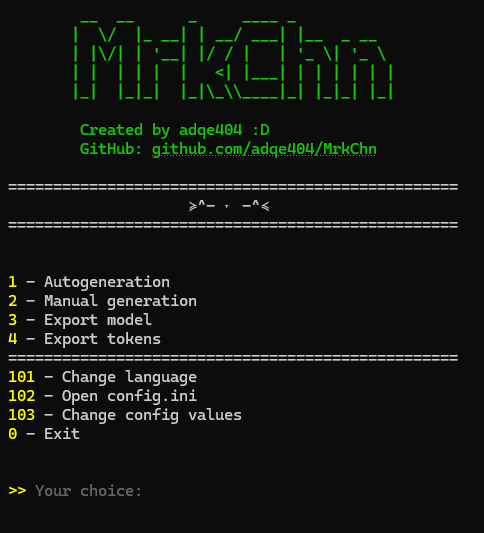

# MrkChn-0.5
my first mini simple program on python with cli for fun.  
generating text based on markov chain  
~~pls dont read that shit!!~~  

## How to use:
> clone the repo or download exe from releases  
> pip install -r requirements.txt  
> in path executable file put any txt file with text  
> after first file start, code create config.ini file  
### config.ini
* seed - first word in generated text, default value is <START>
* text_len - text lenght yeah
* txt_filename - original text file for markov chain
* gen_num - count of generation for one time
* language - en or ru
* kitties_title - dk

**how values of config.ini are parsed you can find in classes/ConfigParser.py**
